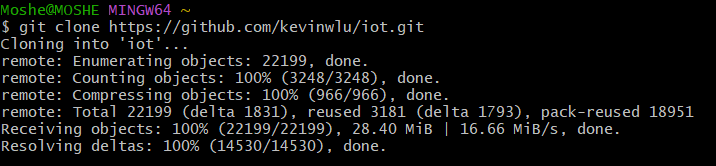
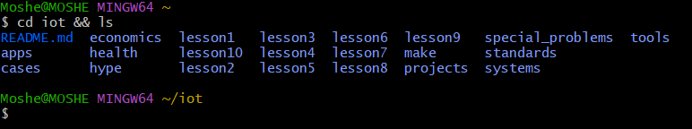
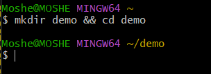
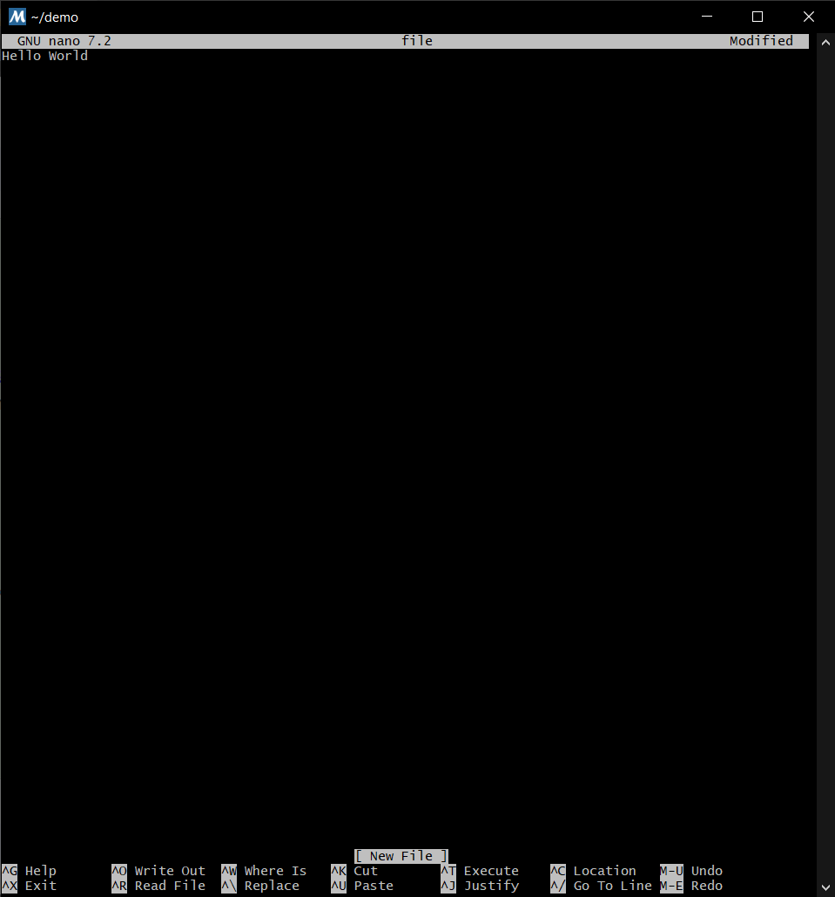
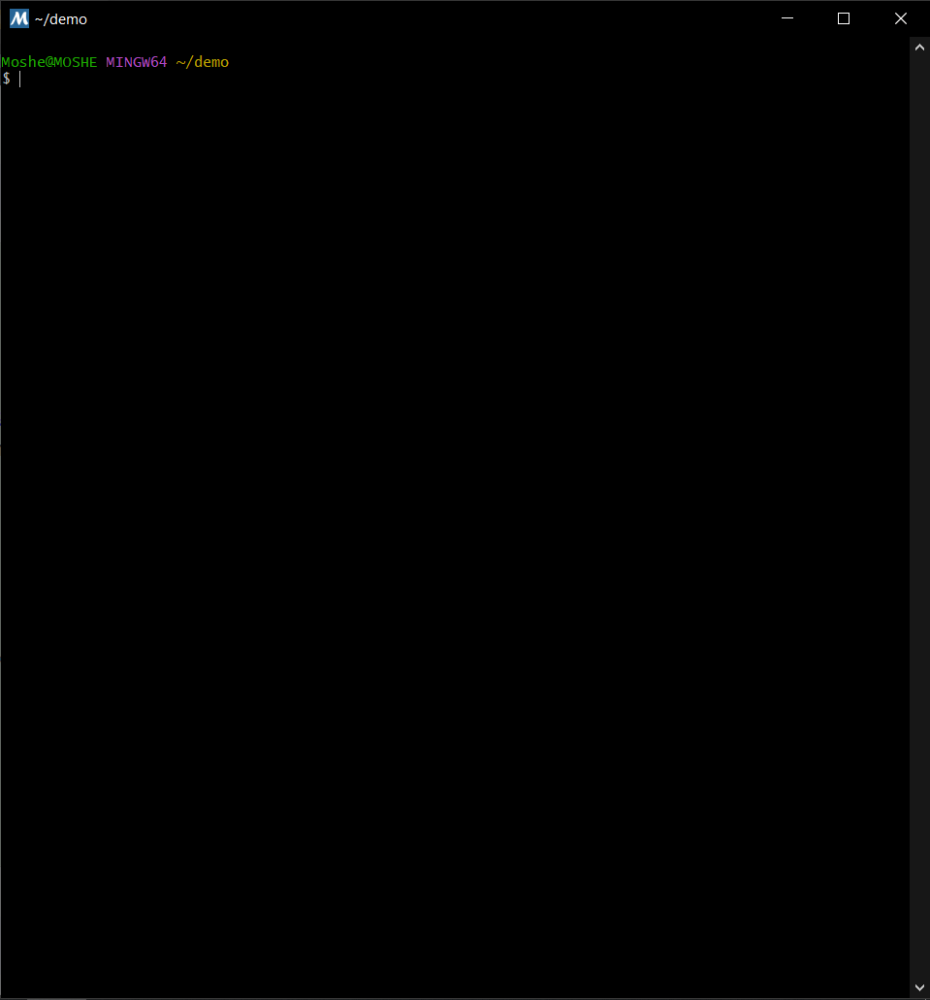
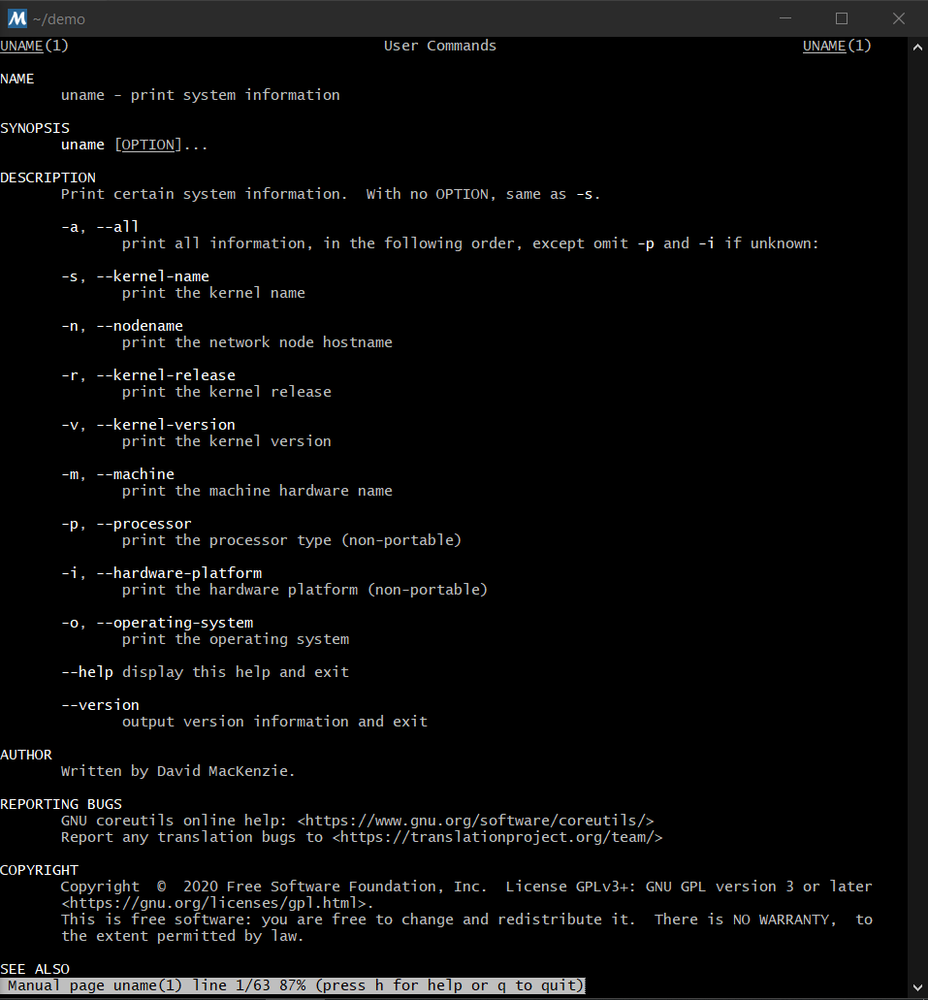

# CPE 322 Lab 2

## Moshe Moskowitz

### Command

`hostname`

### Explanation

Print or set the hostname of the current system.

### Output

```txt
MOSHE
```

---

### Command

`env`

### Explanation

Prints out Environment Variables for the current system.

### Output

*Output hidden for privacy*

---

### Command

`ps`

### Explanation

Reports process status.

### Output

```txt
      PID    PPID    PGID     WINPID   TTY         UID    STIME COMMAND
      652     651     652      32380  pty0      197610 10:44:49 /usr/bin/bash
      839     652     838      34084  pty0      197610 16:38:55 /usr/bin/bash
      838     652     838       9108  pty0      197610 16:38:55 /usr/bin/ps
      651       1     651      24172  ?         197610 10:44:49 /usr/bin/mintty
```

---

### Command

`pwd`

### Explanation

Print the name of the current working directory.

### Output

```txt
/home/Moshe
```

---

### Command

`git clone https://github.com/kevinwlu/iot.git`

### Explanation

Clones the iot repository into a newly created directory.

### Output



---

### Command

`cd iot && ls`

### Explanation

Change the current directory to iot, then lists information about the files inside.

### Output



---

### Command

`cd`

### Explanation

Change the current directory back to the home directory (~ i.e. /home/Moshe)

### Output


---

### Command

`df`

### Explanation

Show information about the file system on which each FILE resides, or all file systems by default.

### Output

```txt
Filesystem     1K-blocks      Used Available Use% Mounted on
C:/msys64      486965244 386233500 100731744  80% /
G:             486965244 391270088  95695156  81% /g
```

---

### Command

`mkdir demo && cd demo`

### Explanation

Creates the directory demo then changes the current directory to the newly created one.

### Output



---

### Command

`nano file`

### Explanation

Opens a text editor within the command line to edit the file 'file'.

### Output



---

### Command

`cat file`

### Explanation

Prints the contents of the file 'file'.

### Output

```txt
Hello World
```

---

### Command

`cp file file1`

### Explanation

Copies file into an additional file 'file1'.

---

### Command

`mv file file2`

### Explanation

Renames file, now calling it 'file2'.

---

### Command

`rm file2`

### Explanation

Removes the file 'file2'.

---

### Command

`clear`

### Explanation

Clears the terminal's text, leaving an empty shell.

### Output



---

### Command

`man uname`

### Explanation

Opens up an manual within the terminal with information about the command 'uname'.

---

### Output



---

### Command

`uname -a`

### Explanation

Print certain system information.

### Output

```txt
MINGW64_NT-10.0-19045 MOSHE 3.4.10.x86_64 2023-12-22 10:06 UTC x86_64 Msys
```

---

### Command

`ipconfig`

### Explanation

Prints information about the computer's current IP configuration.

### Output

```txt

Windows IP Configuration


Unknown adapter Local Area Connection:

   Media State . . . . . . . . . . . : Media disconnected
   Connection-specific DNS Suffix  . : 

Ethernet adapter Ethernet:

   Media State . . . . . . . . . . . : Media disconnected
   Connection-specific DNS Suffix  . : 

Ethernet adapter Ethernet 2:

   Connection-specific DNS Suffix  . : 
   IPv4 Address. . . . . . . . . . . : 192.168.56.1
   Subnet Mask . . . . . . . . . . . : 255.255.255.0
   Default Gateway . . . . . . . . . : 

Wireless LAN adapter Local Area Connection* 1:

   Media State . . . . . . . . . . . : Media disconnected
   Connection-specific DNS Suffix  . : 

Wireless LAN adapter Local Area Connection* 2:

   Media State . . . . . . . . . . . : Media disconnected
   Connection-specific DNS Suffix  . : 

Wireless LAN adapter Wi-Fi:

   Connection-specific DNS Suffix  . : 
   IPv4 Address. . . . . . . . . . . : 192.168.1.33
   Subnet Mask . . . . . . . . . . . : 255.255.255.0
   Default Gateway . . . . . . . . . : 192.168.1.1
```

---

### Command

`ping localhost`

### Explanation

Verifies IP-level connectivity to another the local computer by sending Internet Control Message Protocol (ICMP) echo Request messages.

### Output

```txt
Pinging MOSHE [::1] with 32 bytes of data:
Reply from ::1: time<1ms 
Reply from ::1: time<1ms 
Reply from ::1: time<1ms 
Reply from ::1: time<1ms 

Ping statistics for ::1:
    Packets: Sent = 4, Received = 4, Lost = 0 (0% loss),
Approximate round trip times in milli-seconds:
    Minimum = 0ms, Maximum = 0ms, Average = 0ms
```

---

### Command

`netstat`

### Explanation

Displays protocol statistics and current TCP/IP network connections.

### Output

*Output hidden for privacy*

---

## Sources

* [GNU CoreUtils Manual](https://www.gnu.org/software/coreutils/manual/coreutils.html)
* [Windows Commands Documentation](https://learn.microsoft.com/en-us/windows-server/administration/windows-commands)
